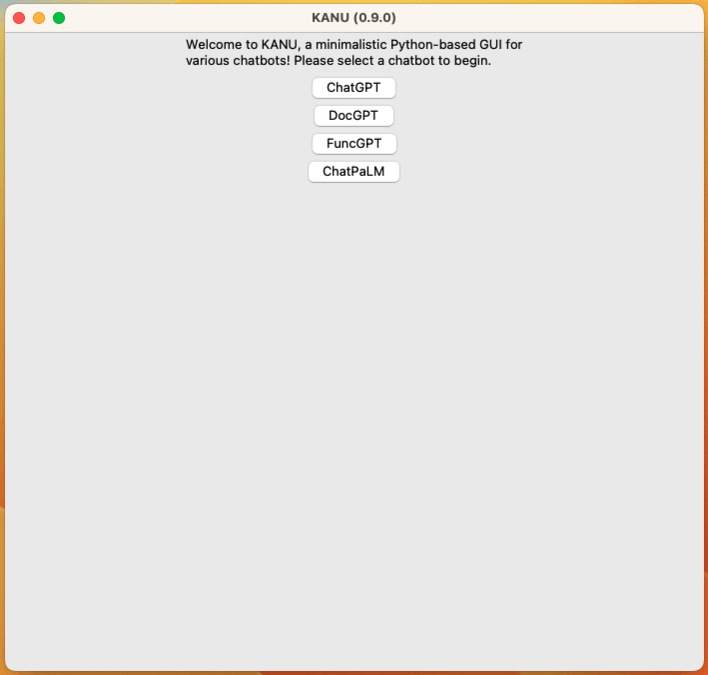

# README

KANU is a minimalistic Python-based GUI for various chatbots.

## Installation

```
$ pip install kanu
```

## Running

```
$ kanu
```

## Screenshots

### Homepage


### ChatGPT



### DocGPT


